# FraudShield

> **Deterministic FinTech Fraud Detection &amp; SOC Defense Architecture**  
> *A production-oriented, explainable payment risk mitigation and security operations platform.*

[](https://nodejs.org/)
[](https://reactjs.org/)
[](https://www.mongodb.com/)
[](https://jestjs.io/)
[](https://vitejs.dev/)
[](LICENSE)

---

## 1. Problem Statement

Modern digital payment ecosystems, real-time transfers, and digital wallets process billions of transactions daily. However, their convenience exposes financial infrastructure to sophisticated threats:

1. **Account Takeover (ATO) & Session Hijacking:** Attackers use stolen credentials or hijacked sessions to drain balances before customers detect the breach.
2. **High-Velocity Drain Attacks:** Automated bots launch rapid bursts of transfers to extract funds across mule accounts before traditional batch analytics run.
3. **Mule Account Funneling:** Stolen funds are routed to newly created recipient accounts with zero transaction history.
4. **Cold-Start Vulnerabilities:** Unvetted accounts with no established 30-day baseline frequently bypass naive percentage-based anomaly checks.
5. **Double-Spending & Replay Attacks:** Network retries, double-clicks, and concurrent requests cause duplicate debits or race conditions in unhardened ledger systems.
6. **Regulatory Non-Compliance & Black-Box Opacity:** Unexplainable machine learning models ("black boxes") that flag payments without explicit regulatory justification violate financial compliance laws and alienate legitimate customers.

---

## 2. Solution Overview

**FraudShield** provides an enterprise-grade, deterministic fraud prevention and Security Operations Center (SOC) incident response platform built entirely on the **MERN stack**.

Instead of opaque probabilistic models that hallucinate risk, FraudShield evaluates every payment synchronously using **6 explainable behavioral heuristics**, computing a mathematical risk score from **0 to 100**. Every score includes an **Explainable Risk Attribution Waterfall** detailing exact baseline deviations and point contributions.

```
Payment Ingestion (Idempotency Key Check)
               │
               ▼
   Deterministic Fraud Engine
   (6 Heuristic Rules Evaluated in < 4.2ms)
               │
   ┌───────────┼───────────┐
   ▼           ▼           ▼
LOW RISK   MEDIUM RISK  HIGH RISK
 (0–30)      (31–70)     (71–100)
   │           │           │
   │           ▼           │
   │      Escrow Hold      │
   │      (heldBalance)    │
   │           │           │
   │      ┌────┴────┐      │
   │      ▼         ▼      │
   │   Step-Up    SOC      │
   │     PIN    Review     │
   │      │         │      │
   ▼      ▼         ▼      ▼
 APPROVED      SETTLED / REFUNDED / BLOCKED
```

### Key Architectural Highlights
- **MongoDB ACID Transactions:** Atomic two-phase transfers with automatic replica set detection and standalone atomic fallback.
- **Payment Idempotency:** IETF-compliant `Idempotency-Key` protection prevents duplicate debits on retries and double-clicks.
- **Concurrency Defense:** Compare-and-Set (CAS) atomic locks prevent race conditions during review resolutions, escrow releases, and refunds.
- **Cold-Start Protection:** Absolute threshold safeguards (> ₹50,000) protect accounts with no historical baseline.
- **Tamper-Evident Audit Chain:** Sequential cryptographic SHA-256 hash chaining links every audit log block to detect database manipulation.
- **Attack-Chain Forensic Timeline:** Correlates cross-entity authentication, device, beneficiary, and payment telemetry into a unified investigation view.
- **SOC Case Management:** Structured analyst lifecycle (`UNASSIGNED` $\to$ `CLAIMED` $\to$ `UNDER_INVESTIGATION` $\to$ `RESOLVED`).
- **On-Demand AI Co-Pilot:** Google Gemini strictly assists analysts with summary generation and inquiry scripting; the deterministic engine remains 100% authoritative.

---

## 3. Architecture & Technology Stack

FraudShield strictly adheres to a robust, decoupled full-stack architecture:

```mermaid
flowchart TD
    subgraph Client["Frontend Client (React 18 + Vite + Tailwind CSS)"]
        UI_Cust["Customer Portal<br/>(Wallet, Send Money, Security, PIN, Devices)"]
        UI_Admin["Admin SOC Console<br/>(Case Queue, Waterfall, Forensic Timeline, Audit Verification)"]
    end

    subgraph Middleware["Express Security & Boundary Layer"]
        AUTH["JWT Authentication & RBAC"]
        IDEM["Idempotency Engine (SHA-256 Request Digest)"]
        JOI["Joi Schema Request Validation"]
        DEV["Device & Telemetry Fingerprinter"]
    end

    subgraph Core["Backend Core Engine (Node.js / Express)"]
        FRAUD["Deterministic Heuristic Fraud Engine (0–100)"]
        WALLET["ACID Financial Mutation Engine (Mongoose Sessions)"]
        SOC["SOC Case Management & CAS Resolution Engine"]
        TIME["Attack-Chain Forensic Timeline Service"]
        AUDIT["Tamper-Evident SHA-256 Audit Ledger Service"]
        GEMINI["Google Gemini AI Co-Pilot (Strictly Advisory)"]
    end

    subgraph Storage["Database Layer (MongoDB)"]
        DB_USER[("Users & Credentials")]
        DB_WALLET[("Wallets (availableBalance, heldBalance)")]
        DB_TX[("Transactions (Attribution, Cases)")]
        DB_DEV[("UserDevices & Trust")]
        DB_IDEM[("IdempotencyRecords (TTL: 24h)")]
        DB_AUDIT[("AuditLogs (Immutable Hash Chain)")]
    end

    Client --> Middleware
    Middleware --> Core
    Core --> Storage
```



### Technical Stack Details
| Layer | Technologies Used |
|---|---|
| **Frontend** | React 18, Vite, Tailwind CSS, Lucide React, Axios |
| **Backend** | Node.js (v18+/v20+), Express.js, Mongoose 8.x |
| **Security** | JWT (JSON Web Tokens), Bcrypt.js (Password & 6-digit PIN hashing), Joi validation |
| **Cryptography** | Node.js `crypto` (SHA-256 payload hashing, canonical audit log hash-chaining) |
| **Database** | MongoDB 6.x/7.x (ACID Sessions, atomic CAS operators, compound indexes) |
| **Testing** | Jest, Supertest (21 test suites, 144 unit and integration tests) |

---

## 4. Deterministic Fraud Detection Engine

Every transaction passes through the deterministic fraud engine before any financial mutation occurs. The engine computes an integer risk score from **0 to 100** by evaluating 6 heuristic rules:

### The 6 Heuristic Rules
| Rule Code | Heuristic Evaluated | Deterministic Thresholds | Point Weight |
|---|---|---|---|
| `RULE_AMOUNT_ANOMALY` | Unusual Transaction Amount | **Cold-start** (> ₹50k with no baseline)<br/>**Established** (> 2x to 3x baseline average)<br/>**Extreme** (> 3x baseline average) | +35 pts (Cold-start)<br/>+20 pts (Elevated)<br/>+35 pts (Extreme) |
| `RULE_VELOCITY_HIGH` | High Transaction Velocity | $\ge$ 4 transactions within a rolling 60-minute window | +25 pts |
| `RULE_DEVICE_NEW` | Unrecognized Hardware Fingerprint | Hardware fingerprint or IP address not in user's trusted device history | +25 pts |
| `RULE_BENEFICIARY_NEW` | New Beneficiary High-Value Outflow | Transfer > ₹10,000 sent to a beneficiary added $< 24$ hours ago | +30 pts |
| `RULE_FAILED_ATTEMPTS_BURST` | Burst of Recent Failed Payments | $\ge$ 3 failed payment attempts within the past 15 minutes | +20 pts |
| `RULE_DORMANT_ACCOUNT_SPIKE` | Dormant Account Sudden Spike | Account inactive $> 30$ days reactivating with transfer > ₹5,000 | +20 pts |

### Explainable Risk Attribution Waterfall
Unlike systems that provide only an aggregate number, FraudShield outputs a structured mathematical breakdown for every decision:

```text
================================================================================
EXPLAINABLE RISK ATTRIBUTION WATERFALL
================================================================================
Base Baseline Score:                               0 pts
+ RULE_AMOUNT_ANOMALY (4.5x 30d baseline of ₹10,000)  +35 pts  [CRITICAL]
+ RULE_DEVICE_NEW (Unrecognized Hardware & IP)        +25 pts  [HIGH]
+ RULE_BENEFICIARY_NEW (Beneficiary added 2h ago)     +30 pts  [HIGH]
+ RULE_FAILED_ATTEMPTS_BURST (3 failures in 15m)      +20 pts  [HIGH]
--------------------------------------------------------------------------------
Raw Accumulated Penalty:                         110 pts
Final Capped Risk Score:                         100 / 100
Assigned Risk Tier:                              HIGH (Hard Blocked)
================================================================================
```

---

## 5. Tri-Tier Financial Routing & Escrow Lifecycle

Transactions are routed deterministically into one of three execution paths:

### 1. LOW RISK (0–30) — Straight-Through Settlement
- **Evaluation:** Transfer complies with all historical baselines and known security signals.
- **Financial Action:** The sender's `availableBalance` is debited and the recipient's `availableBalance` is credited atomically in the same ACID session.
- **Status:** `APPROVED`.

### 2. MEDIUM RISK (31–70) — Escrow Quarantine
- **Evaluation:** Transfer exhibits suspicious behavioral deviation (e.g. 4x amount spike on known device).
- **Financial Action:** The transfer amount is debited from the sender's `availableBalance` and quarantined in `heldBalance`. **Zero funds are credited to the recipient.**
- **Customer Self-Resolution Options:**
  - **Confirm with PIN (`POST /api/transactions/:id/confirm`):** Legitimately initiated transfers can be confirmed using the customer's 6-digit Transaction PIN, atomically releasing held escrow funds to the recipient (`status: APPROVED`).
  - **Decline & Refund (`POST /api/transactions/:id/decline`):** If unauthorized or cancelled, the customer declines the payment. The held amount is atomically restored to `availableBalance` (`heldBalance -= amount`, `availableBalance += amount`), the recipient receives ₹0, the transaction transitions to `REJECTED`, and an audit event plus high-visibility security alert are logged. Duplicate decline attempts are rejected via CAS locks.
- **SOC Intervention:** Quarantined transfers spawn an incident case. Analysts can approve (release escrow to recipient) or reject (refund held balance to sender).
- **Status:** `CUSTOMER_VERIFICATION_REQUIRED` or `FLAGGED_FOR_REVIEW`.

### 3. HIGH RISK (71–100) — Hard Block & Alert
- **Evaluation:** Multi-vector threat pattern (e.g., dormant account + new device + unverified mule beneficiary).
- **Financial Action:** Transaction is halted before wallet mutations. **Zero funds are debited.**
- **SOC Intervention:** High-severity alert is dispatched to the customer and queued as a P1 Critical incident in the SOC console.
- **Status:** `BLOCKED`.

---

## 6. Financial Correctness & Backend Security

### 1. MongoDB ACID Transactions
All financial state transitions—approved transfers, escrow holds, escrow releases, escrow refunds, and dispute settlements—execute inside Mongoose sessions.
```javascript
// Automatic replica set transaction detection with standalone fallback
await runInTransaction(async (session) => {
  await walletService.executeApprovedTransfer(senderId, recipientId, amount, session);
  transaction.status = 'APPROVED';
  await transaction.save({ session });
});
```

### 2. Payment Idempotency Engine
Clients supply an `Idempotency-Key` header with payment requests:
- **Hash Verification:** Request body is hashed with SHA-256 (`requestHash`).
- **Duplicate Protection:** Duplicate requests with matching keys return the original response with `X-Idempotent-Replay: true`.
- **Payload Conflict Detection:** Reusing an existing key with a modified payload triggers `409 IDEMPOTENCY_KEY_PAYLOAD_MISMATCH`.
- **In-Flight Locking:** Concurrent duplicate requests yield `409 IDEMPOTENCY_KEY_IN_PROGRESS`.
- **Automatic TTL:** Records expire automatically after 24 hours.

### 3. Concurrency Protection & State Transitions
State changes use atomic Compare-and-Set (CAS) conditional queries:
```javascript
// Two admins resolving the same case simultaneously cannot double-settle
const transaction = await Transaction.findOneAndUpdate(
  { _id: transactionId, status: 'FLAGGED_FOR_REVIEW' },
  { $set: { status: 'RESOLVING' } },
  { new: true }
);
```

### 4. Cold-Start Fraud Protection
Users with zero 30-day transaction history are protected by an absolute upper ceiling: transfers $> \text{₹}50,000$ trigger `RULE_AMOUNT_ANOMALY` (+35 pts), preventing attackers from exploiting new accounts to bypass behavioral anomaly detection.

### 5. Mandatory 6-Digit Transaction PIN Authentication
- **Universal Requirement:** Enforced on **every outgoing transfer** regardless of amount or risk level (LOW, MEDIUM, or HIGH).
- **Unconfigured Guard:** If a user has not configured a PIN, transfers are rejected immediately with `400 TRANSACTION_PIN_NOT_SET`.
- **Cryptographic Hashing:** The 6-digit PIN is salted and hashed using Bcrypt (`transactionPinHash`).
- **Brute-Force & Lockout Defense:** Invalid PIN submissions yield `401 INVALID_PIN`. Entering 3 consecutive invalid PINs locks the user out of financial transfers for 15 minutes. Zero financial balances are debited if PIN verification fails.
- **Password-Authenticated PIN Reset:** Users who forget or need to change their PIN can reset it via `POST /api/auth/pin/reset` by re-authenticating with their primary account password.

---

## 7. SOC Case Management & Forensic Timeline

Quarantined medium-risk transactions spawn formal incident cases for security analysts:

```
UNASSIGNED ──(Analyst Claims)──► CLAIMED ──(Investigates)──► UNDER_INVESTIGATION ──(Determines)──► RESOLVED
```

- **Case Claiming & Locks:** Prevents two analysts from duplicating review effort on the same incident.
- **Investigation Notes:** Analysts log phone verifications, IP geolocations, and telemetry observations directly on the case record.
- **Attack-Chain Chronological Forensic Timeline:** Correlates authentication successes, password resets, IP anomalies, beneficiary additions, and payment attempts within a 48-hour window into an interactive vertical node graph.
- **On-Demand Gemini AI Co-Pilot:** Synthesizes case evidence, drafts customer verification questions, and summarizes telemetry without holding any decision-making authority.

---

## 8. Tamper-Evident SHA-256 Cryptographic Audit Ledger

Audit logging operates as an append-only cryptographic ledger inspired by blockchain principles:

```
Block 1 (Genesis)              Block 2                        Block 3
┌───────────────────────┐      ┌───────────────────────┐      ┌───────────────────────┐
│ seq: 1                │      │ seq: 2                │      │ seq: 3                │
│ prevHash: GENESIS     │◄─────┤ prevHash: 7a8f...     │◄─────┤ prevHash: 4b2c...     │
│ hash: 7a8f...         │      │ hash: 4b2c...         │      │ hash: 9d1e...         │
│ event: AUTH_LOGIN     │      │ event: ESCROW_HOLD    │      │ event: REVIEW_RESOLVE │
└───────────────────────┘      └───────────────────────┘      └───────────────────────┘
```

1. **Sequential Hash Chaining:** Every log entry hashes its own canonical payload concatenated with the `hash` of the immediately preceding entry.
2. **Database Immutability Hooks:** Mongoose pre-hooks reject `updateOne`, `updateMany`, `deleteOne`, and `deleteMany` operations on the `AuditLog` collection.
3. **Ledger Integrity Verification API:** `GET /api/admin/audit-logs/verify` re-computes every block in sequence. Any altered field, deleted document, or inserted record breaks the chain and flags the exact corrupted sequence number.

---

## 9. Automated Testing & Verification

The codebase includes comprehensive automated test suites using Jest and Supertest, running in-memory with MongoMemoryServer:

```text
PASS tests/idempotency.test.js           (Payment idempotency, replay, conflict detection)
PASS tests/socCase.test.js               (SOC case lifecycle, claims, notes, timeline)
PASS tests/auditChain.test.js           (SHA-256 hash chaining, cryptographic verification)
PASS tests/pinStepUp.test.js             (6-digit PIN setup, step-up verification, lockouts)
PASS tests/review.test.js                (Escrow determinations, notes validation, CAS locks)
PASS tests/dispute.test.js               (Payment disputes, recipient replies, atomic refunds)
PASS tests/wallet.test.js                (ACID balances, deposit limits, negative balance guards)
PASS tests/transaction.test.js           (Tri-tier execution, straight-through transfers)
PASS tests/mediumWorkflow.test.js        (Escrow quarantine, self-confirmation workflow)
PASS tests/beneficiary.test.js           (Beneficiary cooling-off, 24h maturation checks)
PASS tests/device.test.js                (Device fingerprinting, trust management, revocation)
PASS tests/auth.test.js                  (JWT auth, Bcrypt credentials, RBAC boundaries)
PASS tests/audit.test.js                 (Event logging, metadata sanitization, immutability)
PASS tests/alert.test.js                 (Customer alert delivery, read states)
PASS tests/ai.test.js                    (Gemini AI co-pilot fallback and prompts)
PASS tests/amountAnomaly.test.js         (Cold-start thresholds, ratio baselines)
PASS tests/engine/rules.test.js          (Unit tests for all 6 heuristic rules)
PASS tests/engine/fraudEngine.test.js    (Waterfall scoring calculation, risk tiers)
PASS tests/demoScenarios.test.js         (End-to-end integration scenario walkthroughs)
PASS tests/edge-cases.test.js            (Boundary inputs, injection resilience, DB failures)
PASS tests/health.test.js                (Healthcheck probe endpoints)

Test Suites: 21 passed, 21 total
Tests:       151 passed, 151 total
Snapshots:   0 total
Result:      100% Pass Rate
```

### Production Build Verification
The React Vite frontend compiles with **0 errors and 0 lint warnings**:
```text
vite v6.4.3 building for production...
✓ 1689 modules transformed.
dist/index.html                   0.96 kB │ gzip:   0.55 kB
dist/assets/index-CcJuzPCf.css   39.49 kB │ gzip:   7.38 kB
dist/assets/index-DHWK8yVo.js   600.91 kB │ gzip: 146.62 kB
✓ built in 10.84s
```

---

## 10. Engineering Boundaries & Design Decisions

To maintain focus, educational clarity, and production integrity, FraudShield enforces strict engineering boundaries:
- **Simulated Ledger:** Operates on an internal digital wallet ledger. It strictly avoids live banking gateways (Stripe, UPI, Razorpay) to provide an unencumbered environment for testing extreme financial scenarios.
- **Zero Black-Box ML:** Evaluates risk using deterministic heuristics and mathematical waterfalls. No stochastic neural networks or unexplainable models make financial determinations.
- **Advisory AI Only:** Google Gemini acts exclusively as an on-demand co-pilot for SOC analysts. It has no automated authority to debit, credit, or hold customer balances.
- **Pure MERN Stack:** Avoids unnecessary infrastructure bloat (Kafka, Redis, microservices). ACID safety, idempotency caching, and hash chaining are achieved cleanly within Node.js, Express, and MongoDB.

---

## 11. Local Setup & Quickstart

### Prerequisites
- Node.js (`v18.x` or `v20.x`)
- MongoDB running locally on `mongodb://localhost:27017` (standalone or replica set)
- Optional: `GEMINI_API_KEY` for on-demand AI investigation co-pilot

### 1. Clone the Repository
```bash
git clone https://github.com/archi-kumari30/FraudSheild.git
cd FraudSheild
```

### 2. Backend Installation & Start
```bash
cd backend
npm install
npm run dev
```
- API Base URL: `http://localhost:5000/api`
- Healthcheck: `http://localhost:5000/api/health`

### 3. Frontend Installation & Start
```bash
cd ../frontend
npm install
npm run dev
```
- Application Portal: `http://localhost:5173`

### 4. Running the Complete Automated Test Suite
```bash
cd ../backend
npm test
```

### 5. Default Demonstration Credentials
Upon initialization, the backend provisions a default SOC administrator:
- **Admin Email:** `admin@fraudshield.internal`
- **Admin Password:** `AdminPassword123!`
- **Customer Accounts:** Can be registered freely via the frontend portal with auto-provisioned wallet balances.

---

## 12. License

This project is licensed under the MIT License — see the [LICENSE](LICENSE) file for details.
